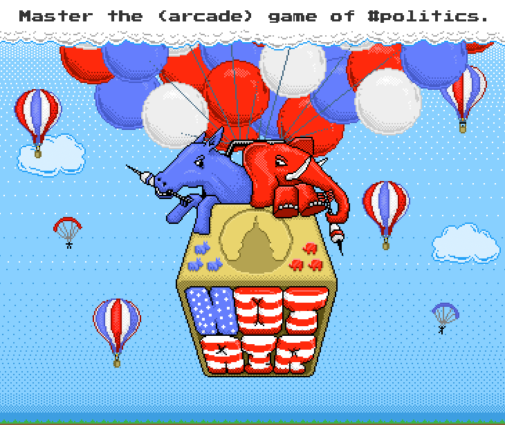

Hot Air (http://hotairgame.com)
===============================

[Hot Air](http://hotairgame.com) is a web-based arcade game that challenges players’ abilities to decode the language of U.S. partisan politics. Pick a side of the aisle and deflate your foes’ real-time twitter rhetoric.

You start by picking a side – and in this game you have two choices; Democrat or Republican. You will then enter a world where your avatar (blue or red, of course) is hovering in the clouds, as balloons filled with hot air rise from below. You can select each balloon and see the text of the anonymous tweet above – your job is to identify party allies and deflate your political opponents with a well-aimed dart.

The balloons you see are tied to actual real-time tweets coming from Republican and Democratic members of the U.S. Congress (thanks to the work of Tweet Congress, who maintain a list of Twitter users). Each “level” has a set number of tweets, and as you get further into the game the balloons rise faster. You can select the different balloons to see their corresponding tweet text, but the tweet’s author remains veiled until the balloon is popped.

Produced by [The Notion Collective](http://notioncollective.com).

Todo
----

 - [x] Add image and description to GH page
 - [ ] Move to new server
 - [ ] Implement Capistrano deployment
 - [ ] Salvage legacy data
 - [ ] Update image sprite build (current one is waaay to cumbersome)

Release Notes
-------------

### 0.3.6
- Added additional logging for couchdb

Build
-----

Eventually we should set up a grunt build system for pre-deployment.

A brief outline of what this would (ideally) include -- items with (*) are higher-priority:

 - Minify js and concatenate into a single file *
 - Minify css
 - Export PSD project files as .PNG images, then combine into sprite sheet(s) *
 - Automatically export sprites.js during sprite sheet creation
 - Upload static files to a CDN
 - Generate documentation using yuidoc

### Sprite build process overview ###

#### PSD Files

The PSD files should be organized in a logical structure, so that related sprites can be grouped together. A basic structure would be:

	imgsrc/
	  |
	  +- master_sprite/
	      |
	      +- simple_sprite_componant.psd
	      +- complex_sprite_component/
	      |    |
	      |    +- complex_sprite_component1.psd
	      |    +- complex_sprite_component2.psd
	      |    +- complex_sprite_component3.psd
	      |
	      +- another_simple_sprite_component.psd
	      :

	      [etc..]

#### PSD Export

When processed, the PSD directory tree will be mapped to the build folder, probably in build/sprite-frames or something similar.

In this structure the only difference is that each PSD is replace by a folder of consecutively number PNG frames of the same name (i.e. balloon.psd --> balloon/)

	imgsrc/
	  |
	  +- master_sprite/
	      |
	      +- simple_sprite_componant/
	      |    |
	      |    +- simple_sprite_componant_0001.png
	      |    +- simple_sprite_componant_0002.png
	      |    +- simple_sprite_componant_0003.png
	      |    :
	      |    [etc..]
	      |
	      +- complex_sprite_component/
	      |    |
	      |    +- complex_sprite_component1/
	      |    |    |
	      |    |    +- complex_sprite_component1_0001.png
	      |    |    +- complex_sprite_component1_0002.png
	      |    |    +- complex_sprite_component1_0003.png
	      |    |    :
	      |    |    [etc..]
	      |    |
	      :    :

	      [etc..]

#### Sprite Mapping

Once the frames are all created, they will need to be combined into a spritesheet that can be used by Crafty.js. Right now the best approach to this seems to be modifying the node-spritesheet package (https://github.com/richardbutler/node-spritesheet).

#### Export Settings

To avoid confusion when sprites are added/removed, or if they are resized, ideally the image build would also export a Crafy.sprite definition that would fill in the necessary values. It may be necessary to modify the Crafty sprite component so that it is able to better manage different sprite sizes/locations in one sheet (will need to investigate this).

#### Current Commonds

This will only work on OX X, and it's still a quite shaky. It will create a directory called `frames` in the same directory as the psd file. The "frames" argument refers to the jsx script to execute (currently "frames" is the only one). _This example executes from the project root_

	osascript script/scpt/jsx.scpt frames [path-to-psd]

The following will output a png and css to the current dir ([sprite-frames-dir].png, [sprite-frames-dir].css). _This example executes from the PSDs diretory._

	glue --ignore-filename-paddings --algorithm=horizontal [sprite-frames-dir] ./

Requires glue, a python library for creating sprites:
 - On github: https://github.com/jorgebastida/glue
 - Installation: http://glue.readthedocs.org/en/latest/installation.html#osx
 - Installing Python/pip on OS X: http://docs.python-guide.org/en/latest/starting/install/osx/#install-osx

Documentation
-------------

The js docs are generated using YUIDoc.  First, install the yuidocjs npm package. Then, to generate the js docs for the modules, navigate to the public/js/modules directory and run:

> yuidoc .

The yuidoc.json config file is tracked in that folder, and contains a few settings that can be updated as needed.

Architecture
------------

 - HA
 - HA.game
 - HA.player
 - HA.mediator
 - HA.enemyController
 - HA.sceneManager
 - HA.twitter

### HA ###
 - namespace

### HA.game ###
 - highScores
 - player
 - levels
 - mediator
 - enemyController
 - sceneManager
 - twitter

### HA.player ###
 - name
 - teamSelection
 - score
 - lives

### HA.mediator ###
 - subscribe
 - publish
 - eventMap

### HA.enemyController ###
 - start
 - stop
 - init (bindEvents)
 - event handlers

### HA.sceneManager ###
 - loadScene

Node modules
------------

(*) Denotes compiled node modules

### Used in runtime ###
 - express (3.0.0rc1)
 - jade (0.27.2)
 - nono (3.3.2)
 - path (0.4.x)
 - twit (0.1.8)
 - lodash (0.6.x)
 - q (0.8.8)
 - cron (1.0.1)
 - time (0.8.3) *
 - useragent (1.1.0)
 - querystring (0.1.0)
 - nodemailer (0.3.28) *

### Used only locally (not in package.js) ###
 - yuidoc (0.3.26)
 - grunt
